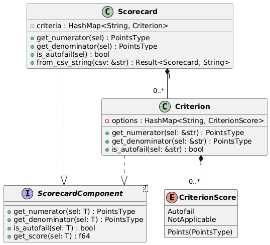

# QAMS Scorecards

A scorecard defines criteria and their associated scores. The following partial class diagram is provided to show the relationships between scorecards, criteria, and criterion scores. Note that the 'classes' in the class diagram are actually implemented as Rust `struct`s, and the "interfaces" are actually implemented as Rust `trait`s.

Note that the `ScorecardComponent` trait achieves the **Composition** design pattern since it provides a unified interface between scorecards and criteria, where a scorecard consists of many criteria.

The QAMS handles creation and editing of scorecards. Scorecards are used to produce [reviews](./reviews.md).

Each scorecard is also associated with a **default reporting duration**, which indicates how often a report is expected to be generated for the scorecard. For example, if a scorecard has a default reporting duration of 1 week, then the software expects that a report will be produced from that scorecard every week. See [reports](./reports.md).